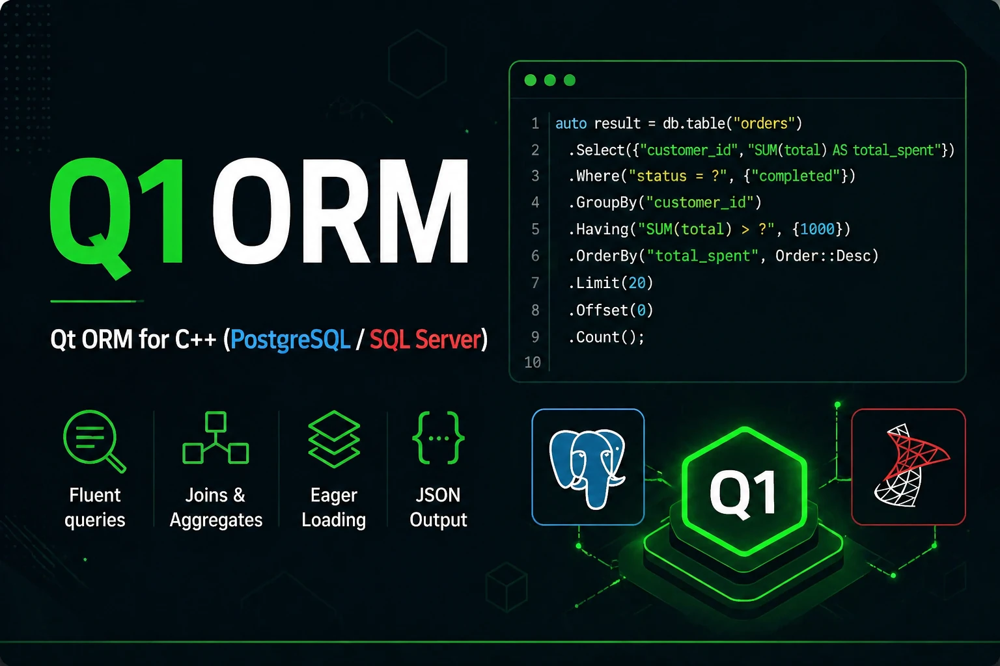

# Q1ORM

<p align="center">
  
</p>

<p align="center">
  <b>Qt-based ORM for C++ with PostgreSQL, SQL Server, MySQL, and SQLite support</b>
</p>

<p align="center">
  Define entities, map them to tables, initialize schema automatically, and run fluent queries with ease.
</p>

<p align="center">
  
  
  
  
  
  
</p>

## Features

- Qt-friendly API built around `Q1Connection`, `Q1Context`, `Q1Entity<T>`, and `Q1Query<T>`
- Supports PostgreSQL, SQL Server, MySQL, and SQLite through a single API
- Automatic schema setup in `Initialize()`: creates missing tables, columns, indexes, and relations
- Schema drift detection: a newly mapped column is applied on the next startup, without migration files or history records
- Fluent query builder for filtering, sorting, joins, grouping, eager loading, and aggregates
- CRUD helpers including bulk `InsertRange`, `UpdateRange`, and `DeleteRange`, plus change tracking
- Scoped transactions via `conn.Transaction()` and safe multi-threaded usage (one connection per thread)
- JSON and table-style output for debugging
- Example applications and test suites included

## Supported databases

| Database | `Q1Driver` value | Qt SQL driver | Default port |
| --- | --- | --- | --- |
| PostgreSQL | `Q1Driver::POSTGRE_SQL` | `QPSQL` | 5432 |
| SQL Server | `Q1Driver::SQLSERVER` | `QODBC` | 1433 |
| MySQL | `Q1Driver::MYSQL` | `QMYSQL` | 3306 |
| SQLite | `Q1Driver::SQLITE` | `QSQLITE` | - |

## Project structure

- `src/` - the main Q1ORM library (`Q1Core`, `Q1Query`, `Q1Migration`, `Q1DatabaseInstall`)
- `Examples/OrmExample/` - cross-database example and assertion suite (CRUD, queries, joins, grouping, JSON, transactions, threads)
- `Examples/DbExample/` - schema-focused tests, including `ModelBuilderTest` and the 300-table `SchemaScaleTest`
- `Docs/` - extra documentation
- `Releases/Release-0.1/` - installed library layout used by the examples
- `Tools/` - helper tools for release packaging and example setup

## Requirements

Before building, make sure you have:

- CMake 3.14 or newer
- Qt 6 with the `Core` and `Sql` modules
- A C++20 compatible compiler

To run queries you also need the relevant Qt SQL driver and a server:

- PostgreSQL: the `QPSQL` plugin
- SQL Server: the `QODBC` plugin and an ODBC driver such as `ODBC Driver 17 for SQL Server`
- MySQL: the `QMYSQL` plugin (on Windows it also needs `libmysql.dll`)
- SQLite: the `QSQLITE` plugin (no server required)

## Build

Build the whole project:

```bash
cmake -S . -B build
cmake --build build
```

If Qt is not auto-detected on your machine, pass your Qt path with `CMAKE_PREFIX_PATH`:

```bash
cmake -S . -B build -DCMAKE_PREFIX_PATH="C:/Qt/6.5.3/msvc2019_64"
cmake --build build
```

On Ubuntu you can use the helper script, which builds into `build-ubuntu` and installs into `Releases/Release-0.1`:

```bash
./release.sh
```

Install the built library into the release layout used by the examples:

```bash
cmake --install build
```

That produces a structure like:

```text
Releases/Release-0.1/
  bin/
  lib/
  include/
  scripts/
```

## Run examples and tests

The examples double as executable tests. After building, run them through CTest:

```bash
ctest --test-dir build --output-on-failure
```

Registered tests:

- `Q1ORM_Example` - `Examples/OrmExample`; runs the full assertion suite against each configured backend
- `Q1ORM_ModelBuilder` - validates model and relationship configuration
- `Q1ORM_SchemaScale300` - 300 mapped tables, 599 indexes, 299 foreign keys, and 30,000 rows on a temporary SQLite database

`Q1ORM_Example` starts a suite per backend. SQLite works out of the box; the other suites need reachable servers (see the configuration below). Set `Q1ORM_VERBOSE=1` to print SQL/CRUD diagnostics instead of the concise summary.

## Database configuration

`Examples/OrmExample/` builds connection settings from environment variables. For each backend it reads a backend-specific prefix and falls back to shared variables:

| Backend | Prefix | Falls back to |
| --- | --- | --- |
| PostgreSQL | `Q1ORM_PG_` | `Q1ORM_DB_*` |
| SQL Server | `Q1ORM_SQLSERVER_` | `Q1ORM_DB_*` |
| MySQL | `Q1ORM_MYSQL_` | `Q1ORM_DB_*` |
| SQLite | `Q1ORM_SQLITE_` | `Q1ORM_DB_*` |

Each set supports `HOST`, `DB_NAME`, `USER`, `PASSWORD`, and `PORT`. The database name additionally falls back to `Q1ORM_TEST_DB_NAME`.

Example for PostgreSQL:

```bash
export Q1ORM_PG_HOST=localhost
export Q1ORM_PG_DB_NAME=q1orm_test
export Q1ORM_PG_USER=postgres
export Q1ORM_PG_PASSWORD=123
export Q1ORM_PG_PORT=5432
```

Example for SQL Server:

```bash
export Q1ORM_SQLSERVER_HOST=localhost
export Q1ORM_SQLSERVER_DB_NAME=q1orm_test
export Q1ORM_SQLSERVER_USER=sa
export Q1ORM_SQLSERVER_PASSWORD=123
export Q1ORM_SQLSERVER_PORT=1433
export Q1ORM_SQLSERVER_ODBC_DRIVER="ODBC Driver 17 for SQL Server"
```

Example for MySQL:

```bash
export Q1ORM_MYSQL_HOST=localhost
export Q1ORM_MYSQL_DB_NAME=q1orm_test
export Q1ORM_MYSQL_USER=root
export Q1ORM_MYSQL_PASSWORD=123
export Q1ORM_MYSQL_PORT=3306
```

Example for SQLite (no server needed):

```bash
export Q1ORM_SQLITE_DB_NAME=q1orm_test.sqlite
```

You can also set the shared fallbacks once:

```bash
export Q1ORM_DB_HOST=localhost
export Q1ORM_DB_USER=postgres
export Q1ORM_DB_PASSWORD=123
export Q1ORM_TEST_DB_NAME=q1orm_test
```

Other variables:

- `Q1ORM_SQLSERVER_ODBC_DRIVER` - pin the ODBC driver for SQL Server (otherwise common drivers are tried in order)
- `Q1ORM_VERBOSE=1` - show full SQL/CRUD diagnostics
- `Q1ORM_SHOWCASE_ALL=1` - repeat the showcase section for every backend

### SQL Server connection string support

For SQL Server, `Q1Connection` can use a DSN or a full ODBC-style server string through the host value. If it already contains `Driver=` or `DSN=`, Q1ORM reuses it as the base connection string and only appends the database name when one is not present.

## Quick start

The normal flow is:

1. Create model classes
2. Map them to tables with `Q1Entity<T>`
3. Create an application context from `Q1Context` and apply the maps
4. Configure a `Q1Connection`
5. Call `Initialize()`
6. Use CRUD and query methods

### 1. Define your models

```cpp
struct Country
{
    int id = 0;
    QString name;
};

struct City
{
    int id = 0;
    QString name;
    int country_id = 0;
};
```

### 2. Map models to tables

Member-pointer based mapping keeps names and types checked by the compiler. Maps are plain classes with a static `ConfigureEntity`; they do not need a base class or an alias.

```cpp
class CountryMap
{
public:
    static void ConfigureEntity(Q1Entity<Country>& entity)
    {
        entity.ToTableName("countries");
        entity.HasKey<&Country::id>().ValueGeneratedOnAdd();
        entity.Property<&Country::name>().IsRequired();
    }
};

class CityMap
{
public:
    static void ConfigureEntity(Q1Entity<City>& entity)
    {
        entity.ToTableName("cities");
        entity.HasKey<&City::id>().ValueGeneratedOnAdd();
        entity.Property<&City::name>().IsRequired();
        entity.Property<&City::country_id>();

        entity.HasOne<Country>().WithMany()
            .HasForeignKey<&City::country_id>()
            .HasPrincipalKey<&Country::id>();
    }
};
```

Additional mapping helpers:

- `entity.Property<&T::x>().HasColumnName("db_column")` - rename the database column without renaming the C++ member
- `entity.Index({"country_id"})` and `entity.Unique({"name"})` - declare indexes
- `entity.HasKey<&T::id>().ValueGeneratedOnAdd()` - map an auto-generated integer key

### 3. Create your `DbContext`

```cpp
class AppDbContext : public Q1Context
{
public:
    explicit AppDbContext(Q1Connection* conn)
    {
        SetConnection(conn, false); // false: the context does not own the connection
        RegisterEntity(&cities);
        RegisterEntity(&countries);
    }

    Q1Entity<City> cities;
    Q1Entity<Country> countries;

protected:
    void OnModelCreating(Q1ModelBuilder& builder) override
    {
        builder.ApplyMap<CityMap>();
        builder.ApplyMap<CountryMap>();
    }
};
```

### 4. Connect and initialize

```cpp
Q1Connection conn(
    Q1Driver::POSTGRE_SQL,
    "localhost",
    "q1orm_test",
    "postgres",
    "123",
    5432
);

AppDbContext ctx(&conn);

if (!ctx.Initialize())
{
    qCritical() << "Initialization failed:" << ctx.GetLastError();
    return 1;
}
```

`Initialize()`:

- opens the database, creating it when the backend supports it
- creates missing tables, columns, indexes, and relations
- compares the mapped schema with the database catalog on every startup

There are no migration files or history tables to manage. Renames, arbitrary type changes, and primary-key changes are reported instead of applied automatically; see `Docs/DatabaseSetup.md` for details.

## CRUD usage

### Insert

```cpp
Country usa;
usa.name = "USA";

if (!ctx.countries.Insert(usa))
{
    qWarning() << ctx.countries.GetLastError();
}

City newYork;
newYork.name = "New York";
newYork.country_id = usa.id;
ctx.cities.Insert(newYork);
```

Bulk insert:

```cpp
QList<City> cities = { /* ... */ };
ctx.cities.InsertRange(cities);
```

### Read

```cpp
QList<City> cities = ctx.cities.Select().ToList();
```

### Update

```cpp
Country country = ctx.countries.Select().Where("id = 1").First();
country.name = "United States";
ctx.countries.UpdateById(country, country.id);

// or with an explicit WHERE clause
ctx.countries.Update(country, "id = 1");
```

Bulk update:

```cpp
ctx.countries.UpdateRange(countries);
```

### Delete

```cpp
ctx.cities.DeleteById(1);
ctx.countries.Delete("id = 2");
```

Bulk delete:

```cpp
ctx.cities.DeleteRange(cities);
```

### Transactions

```cpp
auto transaction = conn.Transaction();
if (!transaction.IsActive())
{
    qCritical() << conn.ErrorMessage();
    return 1;
}

ctx.countries.Insert(country);
ctx.cities.Insert(city);

if (!transaction.Commit())
{
    qCritical() << conn.ErrorMessage();
    return 1;
}
```

The guard rolls back automatically if it goes out of scope without `Commit()`.

## Query guide

Q1ORM query operations are available from `Q1Entity<T>::Select()`. You can chain methods fluently.

### Basic select

Select all columns:

```cpp
QList<City> cities = ctx.cities.Select().ToList();
```

Select specific columns:

```cpp
QList<City> cities = ctx.cities.Select({"id", "name"}).ToList();
```

### Where

```cpp
QList<City> usaCities = ctx.cities.Select()
    .Where("country_id = 1")
    .ToList();
```

Typed operator form, plus `OrWhere` and raw clauses:

```cpp
ctx.cities.Select().Where("country_id", Q1Operator::Equal, 1).ToList();
ctx.cities.Select().Where("name", Q1Operator::Like, "New%").ToList();
ctx.cities.Select().Where("country_id = 1").OrWhere("country_id = 2").ToList();
ctx.cities.Select().WhereRaw("country_id IN (1, 2)").ToList();
```

### Order by

```cpp
ctx.cities.Select().OrderByAsc("name").ToList();
ctx.cities.Select().OrderByDesc("name").ToList();
ctx.cities.Select().OrderBy("id DESC").ToList();
ctx.cities.Select().OrderBy("id", Q1Sort::Descending).ToList();
```

### Limit, Take, Skip

```cpp
QList<City> firstTwo = ctx.cities.Select()
    .OrderByAsc("name")
    .Limit(2)
    .ToList();

ctx.cities.Select().OrderByAsc("name").Take(2).Skip(1).ToList();
```

### Distinct

```cpp
int distinctCountries = ctx.cities.Select()
    .Distinct()
    .Count("country_id");
```

### Aggregate functions

```cpp
int totalCities = ctx.cities.Select().Count();
int maxId = ctx.cities.Select().Max<int>("id");
int minId = ctx.cities.Select().Min<int>("id");
int sumIds = ctx.cities.Select().Sum<int>("id");
double avgId = ctx.cities.Select().Avg<double>("id");
```

### Any and First

```cpp
bool hasCities = ctx.cities.Select().Any();
City first = ctx.cities.Select().Where("country_id = 1").First();
```

### Inner join

```cpp
ctx.cities.Select({"cities.name AS city", "countries.name AS country"})
    .InnerJoin("countries", "cities.country_id = countries.id")
    .OrderByAsc("cities.name")
    .ToList();
```

### Left join

```cpp
ctx.cities.Select({"cities.name AS city", "countries.name AS country"})
    .LeftJoin("countries", "cities.country_id = countries.id")
    .ToList();
```

### Right join

```cpp
ctx.countries.Select({"countries.name AS country", "cities.name AS city"})
    .RightJoin("cities", "countries.id = cities.country_id")
    .ToList();
```

### Full outer join

```cpp
ctx.cities.Select({"cities.name AS city", "countries.name AS country"})
    .FullJoin("countries", "cities.country_id = countries.id")
    .ToList();
```

### Group by

```cpp
ctx.cities.Select({"countries.name AS country", "COUNT(*) AS city_count"})
    .InnerJoin("countries", "cities.country_id = countries.id")
    .GroupBy("countries.name")
    .ToList();
```

### Having

```cpp
ctx.cities.Select({"countries.name AS country", "COUNT(*) AS city_count"})
    .InnerJoin("countries", "cities.country_id = countries.id")
    .GroupBy("countries.name")
    .Having("COUNT(*) > 1")
    .ToList();
```

### Include

`Include()` eager-loads related data. It keeps the typed entity list and also stores the related data in the last JSON result.

```cpp
QList<Country> countries = ctx.countries.Select()
    .Include("cities")
    .ToList();
```

You can also include multiple relations:

```cpp
ctx.cities.Select().Include({"countries"}).ToList();
```

### JSON and table output

Show as a formatted table:

```cpp
ctx.cities.Select().ShowList();
```

Show as formatted JSON:

```cpp
ctx.cities.Select().ShowJson();
```

Export to JSON:

```cpp
QByteArray json = ctx.cities.Select().ToJson();
qDebug().noquote() << json;
```

Read the last JSON result:

```cpp
ctx.cities.Select({"id", "name"}).ToList();
QJsonArray json = ctx.cities.GetLastJson();
```

## Query API reference

These are the main query methods available in `Q1Query<T>`:

| Method | Purpose |
| --- | --- |
| `Select(columns)` | Start a query and optionally choose columns |
| `Where(condition)` | Add a raw `WHERE` clause |
| `Where(column, op, value)` | Add a typed `WHERE` clause (`Q1Operator::Equal`, `NotEqual`, `GreaterThan`, `GreaterOrEqual`, `LessThan`, `LessOrEqual`, `Like`) |
| `OrWhere(condition)` | Add an `OR` branch |
| `WhereRaw(clause)` | Add a raw clause |
| `Distinct()` | Apply `DISTINCT` for aggregate queries such as `Count("column")` |
| `OrderBy(clause)` | Use a custom `ORDER BY` clause |
| `OrderBy(column, direction)` | Sort with `Q1Sort::Ascending` or `Q1Sort::Descending` |
| `OrderByAsc(column)` | Sort ascending |
| `OrderByDesc(column)` | Sort descending |
| `Limit(count)` | Limit returned rows |
| `Take(count)` / `Skip(count)` | Page through results |
| `InnerJoin(table, on)` | Add an inner join |
| `LeftJoin(table, on)` | Add a left join |
| `RightJoin(table, on)` | Add a right join |
| `FullJoin(table, on)` | Add a full outer join |
| `GroupBy(columns)` | Add `GROUP BY` |
| `Having(condition)` | Add `HAVING` |
| `Include(relation)` | Eager-load a relation |
| `Count(column)` | Run `COUNT(...)` |
| `Max<T>(column)` | Run `MAX(...)` |
| `Min<T>(column)` | Run `MIN(...)` |
| `Sum<T>(column)` | Run `SUM(...)` |
| `Avg<T>(column)` | Run `AVG(...)` |
| `Any()` | Check whether at least one row matches |
| `First()` | Return the first matching entity |
| `ToList()` | Execute and return typed entities |
| `ToJson()` | Execute and return JSON bytes |
| `ShowList()` | Execute and print a table |
| `ShowJson()` | Execute and print JSON |

## Important notes

- Call `Initialize()` before CRUD or queries
- `Update()` and `Delete()` require a non-empty `WHERE` clause; prefer `UpdateById()` / `DeleteById()` when you have a key
- For joins, prefer aliased columns such as `cities.name AS city_name` to avoid column name conflicts
- Joined columns are best inspected through `GetLastJson()` when they do not map directly to the entity type
- `ShowList()` flattens included relation data for easy console output
- `ShowJson()` keeps included relation data nested
- Use one `Q1Connection` per thread; `Q1Connection` is not shared between threads

## Use Q1ORM in another CMake project

### Option 1: build from source with `add_subdirectory`

```cmake
add_subdirectory(path/to/Q1ORM)

target_link_libraries(MyApp PRIVATE Src Qt6::Core Qt6::Sql)
target_include_directories(MyApp PRIVATE path/to/Q1ORM/src)
```

Note: the CMake target name is `Src`, while the produced DLL/library output name is `Q1ORM`.

### Option 2: use the installed release output

The examples use this pattern:

```cmake
set(Q1ORM_PATH "${CMAKE_CURRENT_SOURCE_DIR}/../../Releases/Release-0.1")

add_library(Q1ORM SHARED IMPORTED)
set_property(TARGET Q1ORM PROPERTY IMPORTED_LOCATION "${Q1ORM_PATH}/bin/Q1ORM.dll")
set_property(TARGET Q1ORM PROPERTY IMPORTED_IMPLIB "${Q1ORM_PATH}/lib/Q1ORM.lib")
target_include_directories(Q1ORM INTERFACE "${Q1ORM_PATH}/include")

target_link_libraries(MyApp PRIVATE Q1ORM Qt6::Core Qt6::Sql)
```

## More documentation

- `Docs/GettingStarted.md`
- `Docs/CRUDGuide.md`
- `Docs/DatabaseSetup.md`
- `Examples/OrmExample/`
- `Examples/DbExample/`

## License

See `LICENSE`.
