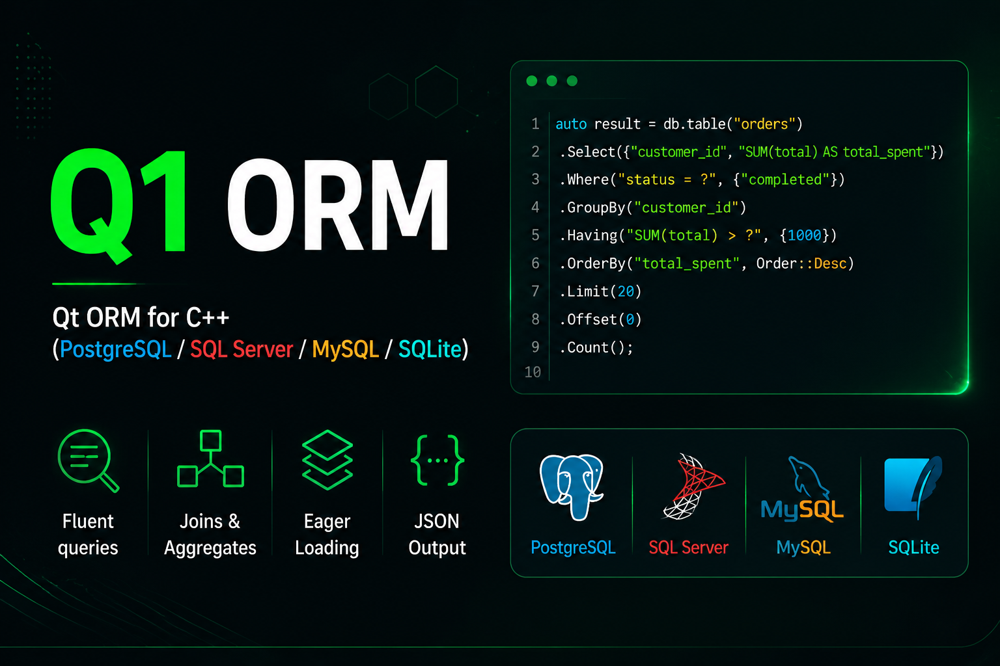

# Q1ORM


Qt 6 ORM for C++20: typed mappings, automatic schema initialization, fluent
queries, CRUD, relations, change tracking, and transactions.
=======
<p align="center">
  
</p>


**One example/test project: `Examples/TestExample`.** It demonstrates ORM and
service usage with automated assertions and clear PASS/FAIL results.

## First: create the release package

Requirements: CMake 3.14+, Qt 6 Core/Sql/Test, and a compiler with C++20
`std::barrier` support (GCC 11+, Visual Studio 2022, or recent Apple Clang).
Download or clone this repository, then run the release script for your system.
The scripts configure, build, and install Q1ORM for you; no separate manual
CMake build commands are needed.

### Linux

From the repository directory, make the script executable and run it:

```bash
chmod +x release.sh
./release.sh
```

On Ubuntu, install the prerequisite packages `build-essential`, `cmake`,
`qt6-base-dev`, and `libqt6sql6-sqlite` first. The script builds in
`build-ubuntu/`. If Qt is not detected automatically, set `QTDIR` to your
Qt installation before running the script.

### Windows

Install Visual Studio 2022 with **Desktop development with C++**, CMake,
and Qt 6 for **MSVC 2022 64-bit**. Match the compiler and Qt architecture.
Run `release.bat` from the repository directory (double-click it or run it
from a command prompt):

```bat
release.bat
```

The script detects Qt and MSVC and builds in `build/`. Set `QTDIR` if your
Qt installation is not found automatically.

### Generated release folder

Both scripts create or update:

```text
Releases/Release-0.1/
  include/     Q1ORM headers
  lib/         Linux shared library or Windows import library
  bin/         Windows Q1ORM.dll and release tools
  scripts/     Database installation helper
```

Use this folder in your own executable project or CMake example; you do not
need to compile Q1ORM sources again in that application. Re-run the release
script after changing the library so the packaged headers and binaries match.
Build the package for the same OS, architecture, compiler, and Qt kit as the
application that consumes it.

The scripts build the tests but do not run the test suite. A successful release
build is not an all-tests-passed result; see the test section below.

### macOS

Install Xcode Command Line Tools, CMake, and a matching Qt 6 kit. The current
`release.sh` targets Linux and uses `nproc`; it is not a macOS release script.
On macOS, open the root `CMakeLists.txt` in Qt Creator, select your macOS Qt kit,
build the Release configuration, and build the CMake `install` target to
populate `Releases/Release-0.1/` with headers and `lib/libQ1ORM.dylib`.

## Test results and coverage

After running the Linux release script:

```bash
./build-ubuntu/bin/TestExample
```

On Windows run `build/bin/Release/TestExample.exe`. Qt Test prints PASS/FAIL
and totals. For individual tests or automated reports, optionally use:

```bash
ctest --test-dir build-ubuntu --output-on-failure
ctest --test-dir build-ubuntu -R Q1ORM.threadedCrud -V
ctest --test-dir build-ubuntu -L scale --output-on-failure
./build-ubuntu/bin/TestExample -functions
./build-ubuntu/bin/TestExample crud aggregates
./build-ubuntu/bin/TestExample -o results.xml,junitxml
```

For Windows CTest commands, replace `build-ubuntu` with `build` and add
`-C Release`. CTest returns zero only
when every selected test passes. Assertions, missing plugins, initialization
errors, and connection failures produce a failing exit code.
Filtered runs prove only their selection. Set `Q1ORM_VERBOSE=1` for SQL logs.

| Test | Checks |
| --- | --- |
| `crud` | Generated IDs, persisted inserts/updates, deletion |
| `bulkCrud` | InsertRange, distinct IDs, UpdateRange, DeleteRange |
| `selects` | Filters, OR, ordered values, limit, skip/take, empty results |
| `boundValues` | Quotes, Unicode, SQL-looking text treated as values |
| `aggregates` | Exact count/min/max/sum/average, distinct and filtered aggregates |
| `grouping` | GroupBy/Having and actual group counts |
| `joinsAndIncludes` | Inner/left joins, unmatched parent, eager-loading values; right/full joins on applicable server backends |
| `jsonAndRawSql` | JSON values, raw scalar SQL and query rows |
| `changeTracking` | Snapshots, dirty fields, changed-field update, clear tracking |
| `transactions` | Commit persistence, automatic/explicit/nested rollback |
| `constraints` | Reject orphan insertion and verify default cascade deletion |
| `errorHandling` | Reject unfiltered writes, report bad SQL, roll back failed bulk insert |
| `sqlGeneration` | Identity SQL for all four dialects without servers |
| `connectionLifecycle` | Reference-counted open/close and reopening |
| `threadedCrud` | Four simultaneous workers, ten ORM CRUD cycles each, final count |
| `services` | CityService validation, persistence, sorted lookup |
| `modelBuilder` | Typed/legacy maps, invalid mappings, relations, schema reconciliation |
| `schemaScale` | 300 tables, 30,000 rows, 599 indexes, 299 foreign keys, schema evolution |

SQLite is the default and uses automatically removed temporary files. Ordinary
tests reseed known data independently. The generated 300-model fixture remains
in `SchemaScale/` within the same executable. These tests cover the listed
behaviors, not every possible input or backend.

## Database connections

| Database | Q1Driver | Qt plugin | Default port |
| --- | --- | --- | --- |
| SQLite | `Q1Driver::SQLITE` | `QSQLITE` | — |
| PostgreSQL | `Q1Driver::POSTGRE_SQL` | `QPSQL` | 5432 |
| MySQL | `Q1Driver::MYSQL` | `QMYSQL` | 3306 |
| SQL Server | `Q1Driver::SQLSERVER` | `QODBC` | 1433 |

SQLite needs no server. Other backends require a reachable server, database
account with schema/data permissions, the matching Qt plugin and native
client libraries. Ubuntu plugin packages include `libqt6sql6-psql`,
`libqt6sql6-mysql`, and `libqt6sql6-odbc`. On Windows/macOS install or build
plugins for the exact Qt/compiler kit. SQL Server additionally needs its ODBC
driver. Inspect `QSqlDatabase::drivers()` and use `QT_DEBUG_PLUGINS=1` to
diagnose plugin loading.

The application API is identical on Windows, Linux, and macOS:

```cpp
Q1Connection sqlite(Q1Driver::SQLITE, "", "application.sqlite", "", "", 0);
Q1Connection postgres(Q1Driver::POSTGRE_SQL, "localhost", "application",
    qEnvironmentVariable("DB_USER"), qEnvironmentVariable("DB_PASSWORD"), 5432);
Q1Connection mysql(Q1Driver::MYSQL, "localhost", "application",
    qEnvironmentVariable("DB_USER"), qEnvironmentVariable("DB_PASSWORD"), 3306);
Q1Connection sqlServer(Q1Driver::SQLSERVER, "localhost", "application",
    qEnvironmentVariable("DB_USER"), qEnvironmentVariable("DB_PASSWORD"), 1433);
```

`Q1ORM_SQLSERVER_ODBC_DRIVER` selects an installed SQL Server ODBC driver.
The SQL Server host argument also accepts a DSN or ODBC connection string.
Keep credentials outside source control.

### Run tests on a server

**Use a dedicated disposable database.** Tests initialize schema and delete/reseed
all rows in `test_cities` and `test_countries`. They leave test data in server
databases. Do not use an application/production database or run multiple test
processes against the same server test database.

Linux/macOS:

```bash
export Q1ORM_TEST_DRIVER=POSTGRES
export Q1ORM_DB_HOST=localhost
export Q1ORM_DB_NAME=q1orm_test
export Q1ORM_DB_USER=q1orm_test
export Q1ORM_DB_PASSWORD='your-test-password'
export Q1ORM_DB_PORT=5432
ctest --test-dir build-ubuntu --output-on-failure
```

Windows PowerShell:

```powershell
$env:Q1ORM_TEST_DRIVER = "POSTGRES"
$env:Q1ORM_DB_HOST = "localhost"
$env:Q1ORM_DB_NAME = "q1orm_test"
$env:Q1ORM_DB_USER = "q1orm_test"
$env:Q1ORM_DB_PASSWORD = "your-test-password"
$env:Q1ORM_DB_PORT = "5432"
ctest --test-dir build -C Release --output-on-failure
```

Supported selections: `SQLITE` (default), `POSTGRES`, `MYSQL`, `SQLSERVER`.
Omit the port to use its default. Server database names are required; usernames
and passwords have no defaults. A selected unavailable backend fails instead
of skipping or falling back. `modelBuilder` and `schemaScale` always use SQLite.
Unset `Q1ORM_TEST_DRIVER` or set it to `SQLITE` to return to the default.

## Use Q1ORM in your application

Run the release script first, then copy `Releases/Release-0.1/` into your
application as `external/Q1ORM/Release-0.1/` (or adjust the path below).
Import the compiled library in your application's `CMakeLists.txt`:

```cmake
cmake_minimum_required(VERSION 3.14)
project(MyApplication LANGUAGES CXX)
find_package(Qt6 REQUIRED COMPONENTS Core Sql)
set(Q1ORM_RELEASE "${CMAKE_CURRENT_SOURCE_DIR}/external/Q1ORM/Release-0.1")
add_library(Q1ORM::Q1ORM SHARED IMPORTED)
set_target_properties(Q1ORM::Q1ORM PROPERTIES
    INTERFACE_INCLUDE_DIRECTORIES "${Q1ORM_RELEASE}/include"
    INTERFACE_COMPILE_FEATURES cxx_std_20
)
target_link_libraries(Q1ORM::Q1ORM INTERFACE Qt6::Core Qt6::Sql)
if(WIN32)
    set_target_properties(Q1ORM::Q1ORM PROPERTIES
        IMPORTED_LOCATION "${Q1ORM_RELEASE}/bin/Q1ORM.dll"
        IMPORTED_IMPLIB "${Q1ORM_RELEASE}/lib/Q1ORM.lib"
    )
elseif(APPLE)
    set_target_properties(Q1ORM::Q1ORM PROPERTIES
        IMPORTED_LOCATION "${Q1ORM_RELEASE}/lib/libQ1ORM.dylib"
    )
else()
    set_target_properties(Q1ORM::Q1ORM PROPERTIES
        IMPORTED_LOCATION "${Q1ORM_RELEASE}/lib/libQ1ORM.so"
    )
endif()
add_executable(MyApplication main.cpp)
target_link_libraries(MyApplication PRIVATE Q1ORM::Q1ORM)
if(WIN32)
    add_custom_command(TARGET MyApplication POST_BUILD
        COMMAND ${CMAKE_COMMAND} -E copy_if_different
            "$<TARGET_FILE:Q1ORM::Q1ORM>" "$<TARGET_FILE_DIR:MyApplication>"
    )
endif()
```

The target propagates include paths, C++20, and Qt Core/Sql dependencies.
For a non-CMake executable project, add `include/` to its header search paths,
link the library from `lib/`, and link Qt Core/Sql. Windows applications need
`Q1ORM.dll` beside the executable as well as Qt runtime DLLs/plugins.
On Linux/macOS, the runtime loader must be able to locate Q1ORM and Qt.
Qt SQL server plugins also need their native client dependencies.

The repository's `TestExample` links the source library to test current changes.
The imported target above is for your own examples/applications using the release.

The example separates plain records (`Models.h`), typed maps/entity sets
(`ApplicationContext.h`), business logic (`CityService.h`), assertions
(`OrmTests.cpp`), and the runner (`main.cpp`).

### Map entities

```cpp
struct Country
{
    int id = 0;
    QString name;
};

struct CountryMap
{
    static void ConfigureEntity(Q1Entity<Country>& entity)
    {
        entity.ToTableName("countries");
        entity.HasKey<&Country::id>().ValueGeneratedOnAdd();
        entity.Property<&Country::name>().IsRequired();
    }
};

class AppContext : public Q1Context
{
public:
    explicit AppContext(Q1Connection& connection)
    {
        SetConnection(&connection, false);
        RegisterEntity(&countries);
    }
    Q1Entity<Country> countries;

protected:
    void OnModelCreating(Q1ModelBuilder& builder) override
    {
        builder.ApplyMap<CountryMap>();
    }
};
```

Include `<Q1ORM.h>` and create a `QCoreApplication` before using Qt SQL.
The connection must outlive the context:

```cpp
Q1Connection connection(Q1Driver::SQLITE, "", "application.sqlite", "", "", 0);
AppContext context(connection);
if (!context.Initialize())
{
    qCritical() << context.GetLastError();
    return 1;
}
Country country{0, "Canada"};
if (!context.countries.Insert(country))
    return 1;
country.name = "Updated";
if (!context.countries.UpdateById(country, country.id))
    return 1;
const auto rows = context.countries.Select()
    .Where("name", Q1Operator::Equal, country.name)
    .OrderBy("id", Q1Sort::Ascending).Skip(0).Take(10).ToList();
const int count = context.countries.Select().Count();
if (!context.countries.DeleteById(country.id))
    return 1;
```

`Initialize()` creates missing schema objects and reconciles mappings.
Check its return value; a required new column without a default can fail on
populated tables. Back up application data before schema changes.
Use bound `Where(column, operator, value)` for user values. Raw SQL clauses,
identifiers, join expressions, and aggregate expressions must be trusted SQL.

### Use services

Q1ORM has no dependency-injection container. Create small services that receive
a context, as demonstrated by `CityService.h`. With the example headers:

```cpp
ApplicationContext context(connection);
if (!context.Initialize())
    return 1;
CityService service(context);
Country country{0, "Canada"};
if (!context.countries.Insert(country))
    return 1;
City city{0, "Montreal", country.id, 100};
if (!service.Create(city))
{
    qCritical() << service.LastError();
    return 1;
}
const auto cities = service.InCountry(country.id);
```

The service trims names, validates population/country, and persists through
the ORM. Tests cover successful writes and rejected requests.

### Transactions and threading

```cpp
auto transaction = connection.Transaction();
if (!connection.InTransaction())
    return 1;
Country country{0, "Transactional"};
if (!context.countries.Insert(country))
    return 1;
if (!transaction.Commit())
    return 1;
```

Uncommitted guards roll back at scope exit. Nested transactions join the outer
transaction; an inner rollback prevents the outer commit.

Create and destroy a separate connection, context, and service inside each
worker thread. Initialize schema before launching workers. Do not share Qt SQL
handles/entity sets across threads. `threadedCrud` demonstrates simultaneous
ORM reads and writes against the same database with independent connections.

## GitHub

`.github/workflows/ci.yml` builds and tests SQLite on Linux, Windows, and macOS
for pushes and pull requests, uploading test logs even on failure.
Check Actions for the exact commit. A green SQLite run does not certify server
backends; run them explicitly using the settings above.

Publish reviewed changes to the existing remote:

```bash
git add -A
git commit -m "Consolidate ORM examples and automated tests"
git push origin HEAD
```

This publishes source, not a hosted application or database.

## References

- Qt CMake setup: https://doc.qt.io/qt-6/cmake-get-started.html
- Qt SQL plugins: https://doc.qt.io/qt-6/sql-driver.html
- Windows deployment: https://doc.qt.io/qt-6/windows-deployment.html
- MIT license: see `LICENSE`.
